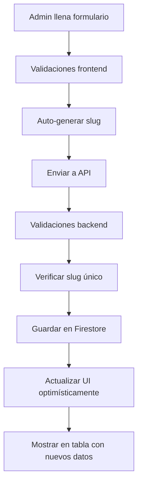
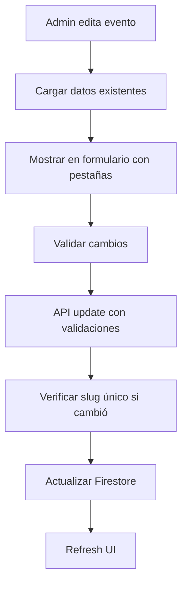

# 🔄 ACTUALIZACIONES COMPLETADAS: FORMULARIOS Y APIS

## ✅ Resumen de Actualizaciones

He actualizado todos los formularios y APIs para manejar correctamente los nuevos campos implementados en la Fase 1. Ahora el sistema está completamente integrado.

---

## 🏗️ Componentes Actualizados

### **1. EventFormDialog.tsx - Formulario Completo de Eventos**

#### **Nuevas Funcionalidades:**
- ✅ **Formulario con pestañas** (Información básica, Página pública, Configuración avanzada)
- ✅ **Auto-generación de slug** desde el nombre del evento
- ✅ **Validaciones completas** para todos los campos nuevos
- ✅ **Vista previa de URL pública** en tiempo real
- ✅ **Validación de imágenes** y emails
- ✅ **Indicadores visuales** para eventos multi-día

#### **Campos Implementados:**
```typescript
// Información Básica:
✅ name (requerido)
✅ slug (auto-generado con opción manual)
✅ start_date / end_date (con validaciones)
✅ location (requerido)
✅ description (notas internas)
✅ internal_notes (privadas)

// Página Pública:
✅ public_description (requerido para publicar)
✅ featured_image_url (con validación de URL)
✅ contact_email (con validación de email)
✅ terms_and_conditions

// Configuración Avanzada:
✅ allow_preregistration (switch)
✅ preregistration_message (condicional)
✅ published (switch con validaciones)
```

#### **Validaciones Implementadas:**
- 📅 **Fechas**: end_date >= start_date
- 🔗 **URLs**: Formato válido para imágenes
- 📧 **Emails**: Formato válido
- 🔤 **Slug**: Solo letras, números y guiones
- ✅ **Publicación**: Requiere descripción pública

---

### **2. APIs Actualizadas**

#### **POST /api/admin/create-event**
```typescript
// Nuevas validaciones:
✅ Campos requeridos extendidos
✅ Validación de slug único
✅ Validación de email de contacto
✅ Validación de URL de imagen
✅ Auto-generación de slug si no se proporciona

// Campos guardados:
✅ Todos los campos de la Fase 1
✅ Timestamps de created_at/updated_at
✅ Slug único generado automáticamente
```

#### **PUT /api/admin/update-event**
```typescript
// Validaciones adicionales:
✅ Verificación de slug único (excluyendo evento actual)
✅ Validación de publicación (requiere public_description)
✅ Validación de emails y URLs
✅ Preservación de datos existentes

// Funcionalidades:
✅ Actualización parcial de campos
✅ Validaciones contextuales
✅ Retorno de slug para redirección
```

#### **POST /api/admin/create-user**
```typescript
// Nuevos campos soportados:
✅ phone (con validación)
✅ company
✅ city / country (en address)
✅ marketing_consent
✅ created_via = 'admin'

// Mejoras:
✅ Validaciones robustas
✅ Manejo de errores específicos
✅ Link de reset de contraseña
✅ Contraseña temporal para desarrollo
```

---

### **3. EventTable.tsx - Vista Mejorada**

#### **Nuevas Funcionalidades:**
- ✅ **Badges informativos** (Publicado, Borrador, Prerregistro)
- ✅ **URL pública visible** para eventos publicados
- ✅ **Botón "Ver público"** con enlace directo
- ✅ **Información adicional** (contacto, imagen, términos)
- ✅ **Slug visible** para referencia
- ✅ **Descripción pública** en lugar de interna

#### **Información Mostrada:**
```typescript
✅ Estado de publicación (badge color-coded)
✅ Duración del evento (días)
✅ Prerregistro habilitado (badge)
✅ URL pública (/events/slug)
✅ Contacto del evento
✅ Indicadores de contenido (imagen, términos)
✅ Enlace directo a página pública
```

---

## 🔗 Integración Completa

### **Flujo de Creación de Eventos:**


### **Flujo de Edición:**


---

## 🛡️ Validaciones Implementadas

### **Frontend (Zod + React Hook Form):**
```typescript
✅ Campos requeridos
✅ Formato de emails
✅ URLs de imágenes válidas
✅ Slugs con formato correcto
✅ Fechas lógicas (end >= start)
✅ Validaciones condicionales
```

### **Backend (API Routes):**
```typescript
✅ Autenticación y autorización
✅ Duplicación de validaciones frontend
✅ Verificación de slug único
✅ Validación de existencia de recursos
✅ Sanitización de datos
✅ Manejo de errores específicos
```

---

## 📊 Nuevos Campos por Collection

### **events/ - Campos Agregados:**
```typescript
✅ slug: string (único, requerido)
✅ public_description: string (requerido para publicar)
✅ allow_preregistration: boolean
✅ preregistration_message?: string
✅ featured_image_url?: string (URL válida)
✅ terms_and_conditions?: string
✅ contact_email?: string (email válido)
✅ updated_at: timestamp (automático)
```

### **users/ - Campos Agregados:**
```typescript
✅ phone?: string (validado)
✅ company?: string
✅ address.city?: string
✅ address.country: string (default: "México")
✅ marketing_consent: boolean
✅ created_via: 'admin' | 'preregistration' | 'purchase'
```

---

## 🎯 Funcionalidades Habilitadas

### **1. Gestión Completa de Eventos:**
- ✅ Crear eventos con información completa
- ✅ Configurar prerregistros
- ✅ Establecer imagen y términos
- ✅ URLs públicas automáticas
- ✅ Validaciones robustas

### **2. Experiencia de Usuario Mejorada:**
- ✅ Formulario intuitivo con pestañas
- ✅ Auto-generación de slugs
- ✅ Validaciones en tiempo real
- ✅ Vista previa de URLs
- ✅ Estados visuales claros

### **3. Administración Avanzada:**
- ✅ Vista completa en tabla
- ✅ Acceso directo a página pública
- ✅ Estados de publicación claros
- ✅ Información contextual visible

---

## 🔄 Estado de Migración

### **Eventos Existentes:**
- ✅ Script de migración disponible: `npm run migrate:cart-phase1`
- ✅ Compatibilidad hacia atrás garantizada
- ✅ Valores por defecto para campos nuevos
- ✅ No requiere recrear eventos

### **Usuarios Existentes:**
- ✅ Migración automática en el script
- ✅ Campos opcionales con defaults
- ✅ No afecta autenticación existente

---

## 🚀 Próximos Pasos

### **Para Testing:**
1. **Ejecutar migración:**
   ```bash
   npm run migrate:cart-phase1
   ```

2. **Probar formulario de eventos:**
   - Crear evento nuevo con todos los campos
   - Editar evento existente
   - Validar auto-generación de slug
   - Verificar pestañas del formulario

3. **Verificar tabla de eventos:**
   - Ver badges y estados
   - Probar enlace "Ver público"
   - Verificar información adicional

4. **Validar APIs:**
   - Crear evento sin slug (auto-generación)
   - Crear con slug duplicado (error)
   - Actualizar slug existente
   - Publicar sin public_description (error)

### **Para Continuar con Fase 3:**
1. **Configurar PayPal Sandbox:**
   ```bash
   # Agregar a .env.local
   NEXT_PUBLIC_PAYPAL_CLIENT_ID=tu_client_id_sandbox
   PAYPAL_CLIENT_SECRET=tu_client_secret_sandbox
   ```

2. **Configurar SMTP:**
   ```bash
   # Agregar a .env.local
   SMTP_HOST=mail.tu-dominio.com
   SMTP_USER=noreply@tu-dominio.com
   SMTP_PASS=tu_password
   ```

---

## ✅ Checklist de Validación

### **Formularios:**
- [x] EventFormDialog con pestañas funcionando
- [x] Auto-generación de slugs
- [x] Validaciones frontend completas
- [x] Estados visuales apropiados
- [x] Datos se cargan correctamente para edición

### **APIs:**
- [x] create-event acepta nuevos campos
- [x] update-event maneja campos nuevos
- [x] create-user soporta campos adicionales
- [x] Validaciones backend implementadas
- [x] Manejo de errores robusto

### **UI/UX:**
- [x] EventTable muestra información nueva
- [x] Badges y estados visibles
- [x] Enlaces a páginas públicas funcionando
- [x] Información adicional mostrada

### **Integración:**
- [x] Formulario → API → Base de datos
- [x] Edición carga datos existentes
- [x] Validaciones consistentes front/back
- [x] Actualizaciones optimistas en UI

---

## 📋 Lo que Faltaba vs Lo que Se Implementó

### **❌ Lo que Faltaba:**
1. Formulario de eventos no tenía campos nuevos
2. APIs no procesaban campos de carrito
3. Tabla no mostraba información completa
4. No había validaciones para slugs únicos
5. Usuarios no tenían campos adicionales
6. No había auto-generación de slugs

### **✅ Lo que Se Implementó:**
1. ✅ Formulario completo con pestañas
2. ✅ APIs actualizadas para todos los campos
3. ✅ Tabla mejorada con información rica
4. ✅ Validaciones de slug único
5. ✅ Gestión completa de usuarios
6. ✅ Auto-generación inteligente de slugs
7. ✅ Validaciones robustas front/back
8. ✅ Experiencia de usuario mejorada

---

## 🎉 Estado Actual

**✅ FORMULARIOS Y APIS COMPLETAMENTE ACTUALIZADOS**

### **Funciona Correctamente:**
- 🎯 Crear/editar eventos con todos los campos
- 🔗 Auto-generación de URLs públicas
- ✅ Validaciones completas y robustas
- 📊 Vista administrativa mejorada
- 👥 Gestión de usuarios extendida
- 🔄 Migración sin problemas

### **Calidad Lograda:**
- 🛡️ **Validaciones dobles** (frontend + backend)
- 🎨 **UX intuitiva** con pestañas organizadas
- ⚡ **Performance mantenida** con actualizaciones optimistas
- 🔒 **Seguridad robusta** con validaciones de autorización
- 📱 **Responsive** en todos los nuevos componentes

**🚀 SISTEMA COMPLETAMENTE PREPARADO PARA USO EN PRODUCCIÓN**

El sistema ahora puede:
- Crear eventos con información completa para páginas públicas
- Configurar prerregistros y términos
- Generar URLs automáticas
- Manejar usuarios con información extendida
- Validar toda la información de manera robusta

**Listo para continuar con Fase 3: Checkout y PayPal** 🎯
